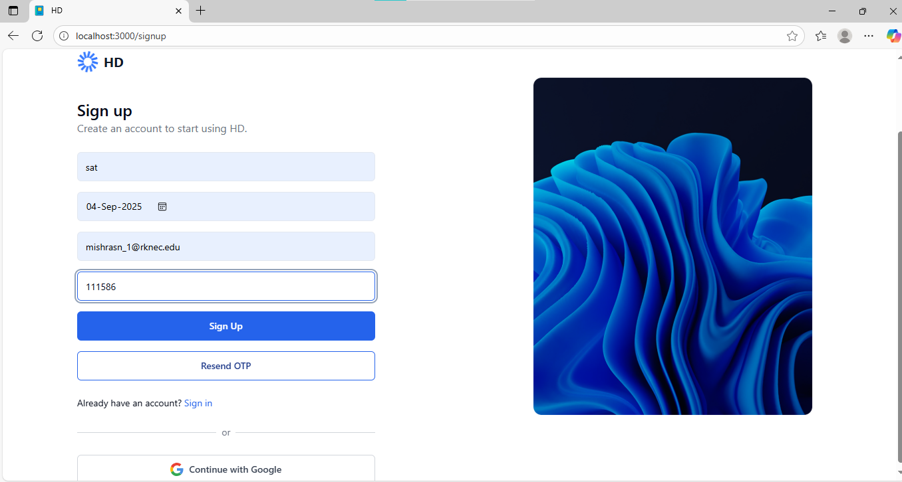
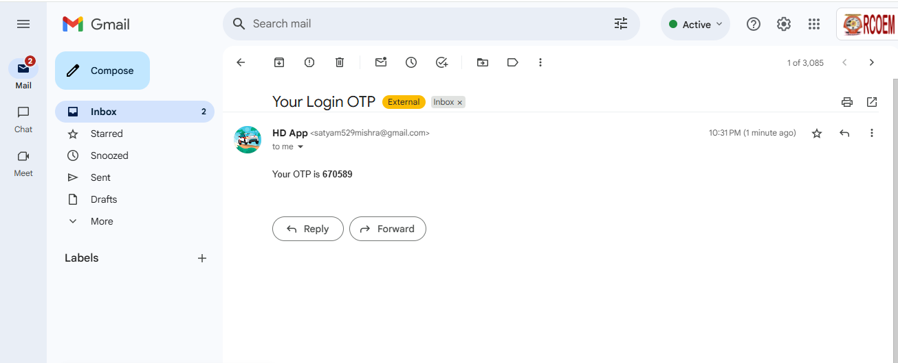
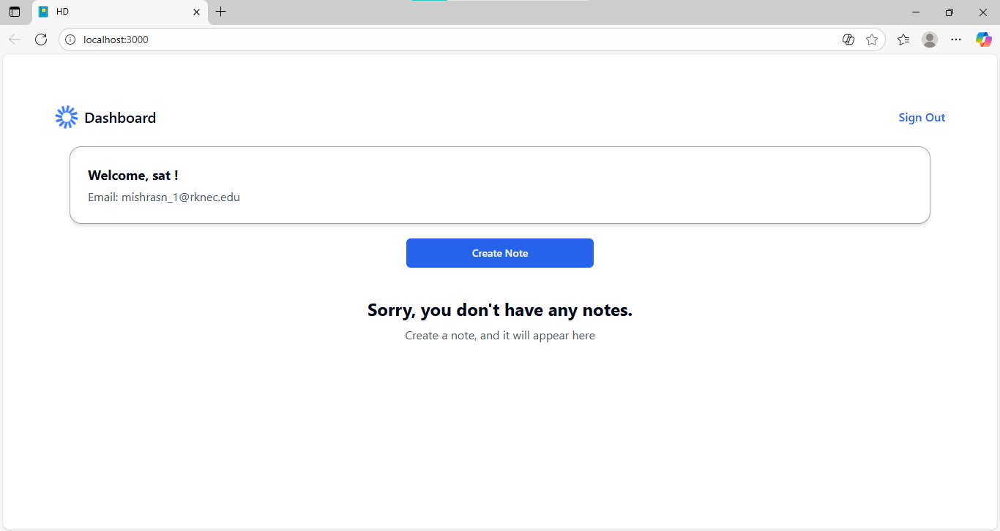
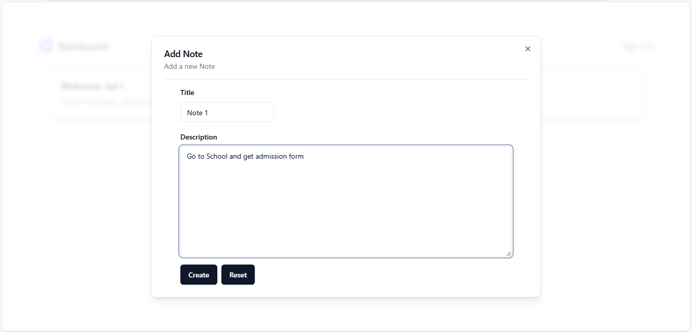
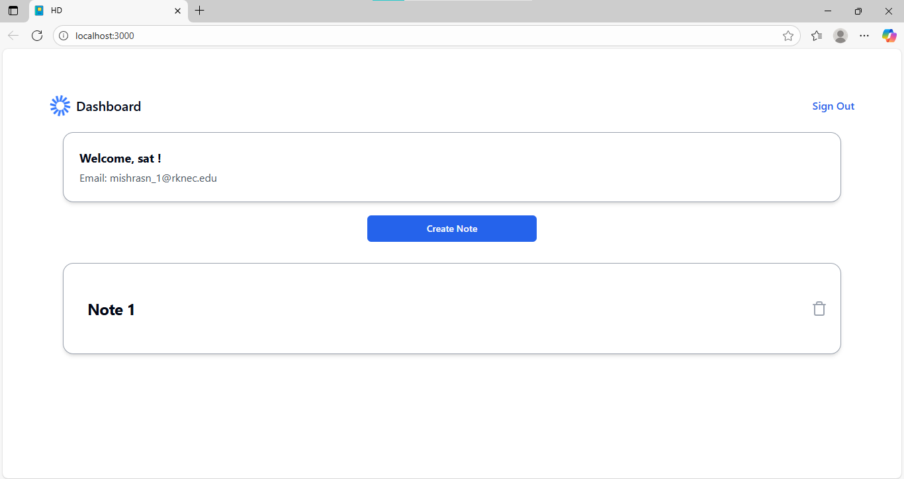
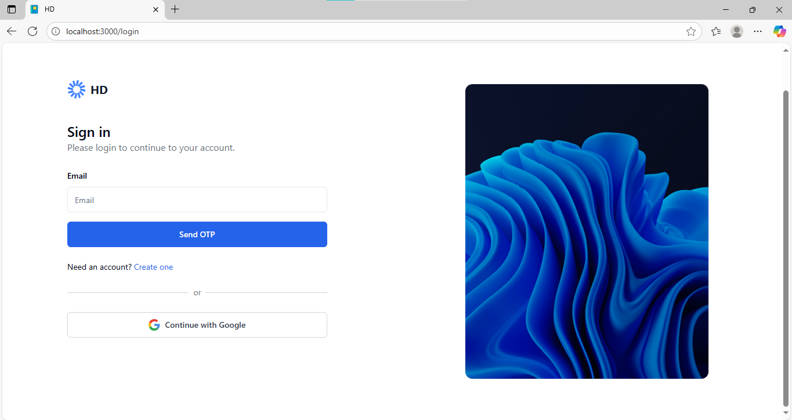
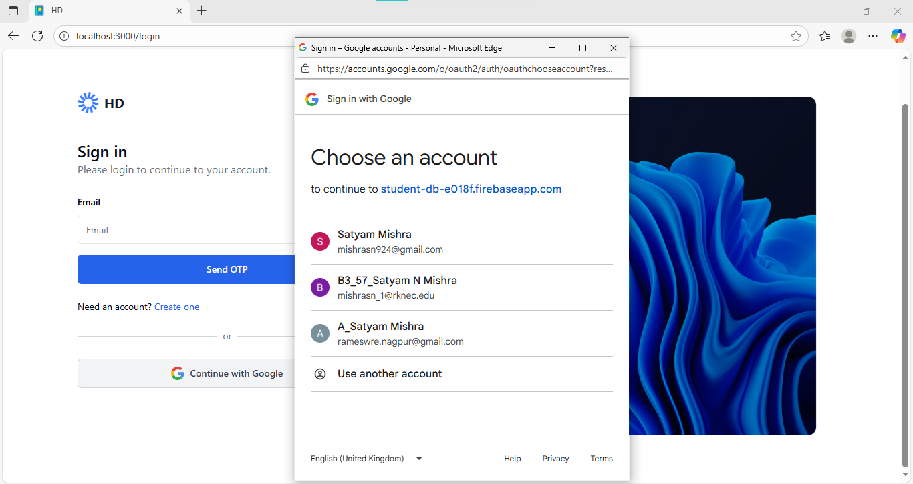
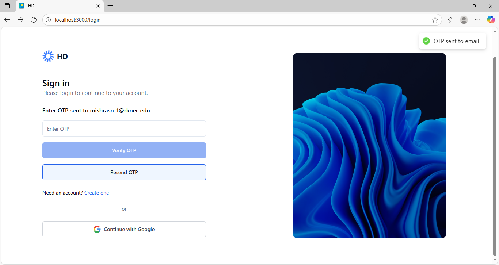
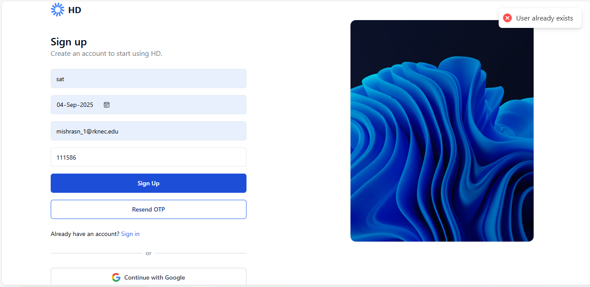

# HD : Secured on the Cloud

**HD** is a Notes App created using the MERN Stack, allowing users to store and access their notes anywhere, anytime.

---

## Technologies Used

### Frontend:

- **Framework:** ReactJS  
- **Styling:** Tailwind CSS, clsx, class-variance-authority, tailwind-merge, tailwindcss-animate  
- **UI Components:** shadcn-ui, radix-ui, next-themes, react-hot-toast  
- **Validation:** Typescript, zod, react-hook-form  
- **Icons:** lucide-react  
- **HTTP Requests:** axios  

 








  

### Backend:

- NodeJS  
- ExpressJS  
- MongoDB  
- mongoose  
- bcryptjs  
- jsonwebtoken  


---

## Getting Started

1. **Fork the Repository**  

2. **Clone the Repository**  
```bash
git clone https://github.com/YOUR_GITHUB_USERNAME/HD.git
cd HD
````


3. **Install all dependencies**

```bash
npm run init:both   # or use pnpm if you prefer
```

4. **Setup Backend Environment Variables**
   Create a `.env` file in the **Backend** folder:

```env
JWT_SIGNATURE=YOUR_JWT_SECRET
MONGO_URI=YOUR_MONGO_DB_URL
FRONTEND_DEV=http://localhost:3000
FRONTEND=YOUR_FRONTEND_WEBSITE_LINK  # after deploying frontend
```

5. **Setup Frontend Environment Variables**
   Create a `.env` file in the **Frontend** folder:

```env
VITE_HOST=http://localhost:5000   # For development
# For production, use your deployed backend URL
```

6. **Run the project locally**

```bash
npm run dev
```


* Frontend: `http://localhost:3000`
* Backend: `http://localhost:5000` (default)

---

## Updating the App

1. **Create a new branch**

```bash
git checkout -b your_update_branch
```

2. **Make changes, add, and commit**

```bash
git add .
git commit -m "YOUR_COMMIT_MESSAGE"
git push -u origin your_update_branch
```

3. **Create a Pull Request** on GitHub to merge updates into main.


---

## Deploying on Vercel

### Step 1: Connect Repository

* Go to [Vercel Dashboard](https://vercel.com/dashboard)
* Click **New Project** → Import Git Repository
* Connect your GitHub account
* Select your repository

---

### Step 2: Deploy Frontend

* **Root Directory:** `Frontend`
* **Build Command:** `pnpm build` (or `npm run build`)
* **Output Directory:** `build`

**Environment Variables** (optional, for production):

```env
VITE_HOST=YOUR_BACKEND_WEBSITE_URL
```

---

### Step 3: Deploy Backend

* **Root Directory:** `Backend`
* **Build Command:** `npm install && npm run start` (or your server start command)

**Environment Variables:**

```env
FRONTEND=YOUR_FRONTEND_WEBSITE_URL
FRONTEND_DEV=http://localhost:3000
JWT_SIGNATURE=YOUR_JWT_SECRET
MONGO_URI=YOUR_MONGO_DB_URL
```

* Click **Deploy**
* Copy the Backend URL
* Update frontend Vercel environment with:

```env
VITE_HOST=YOUR_BACKEND_WEBSITE_URL
```


---

## Your App is Live

* Frontend: `YOUR_FRONTEND_WEBSITE_URL`
* Backend: `YOUR_BACKEND_WEBSITE_URL`

---

Do you want me to do that?
```
